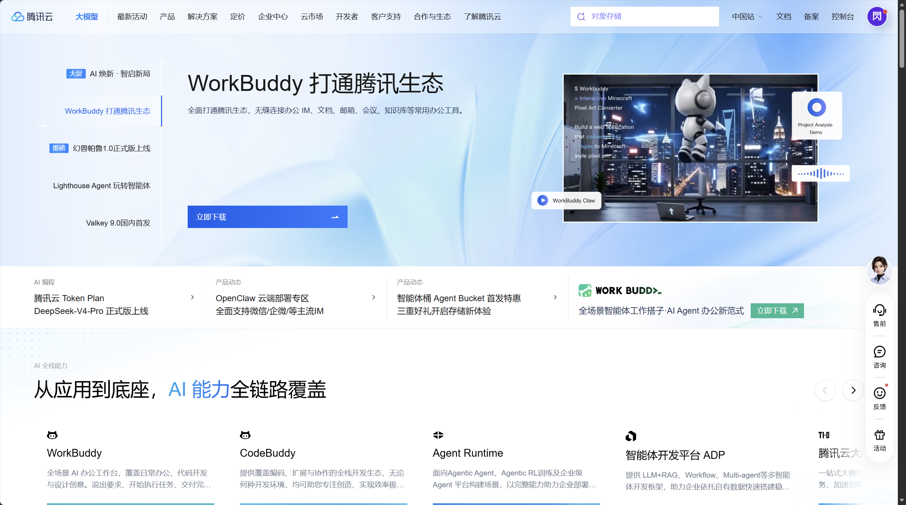
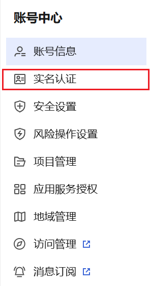
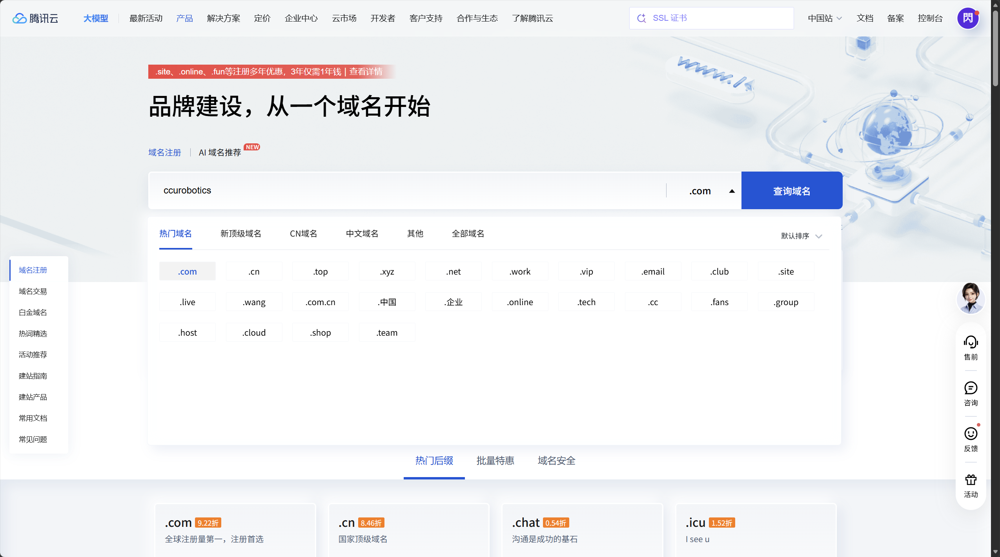
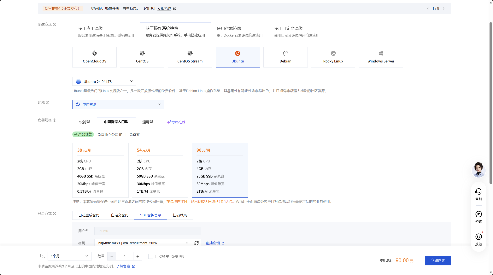
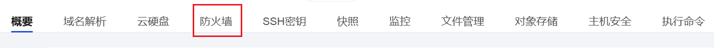
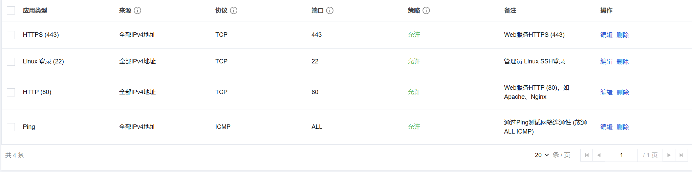
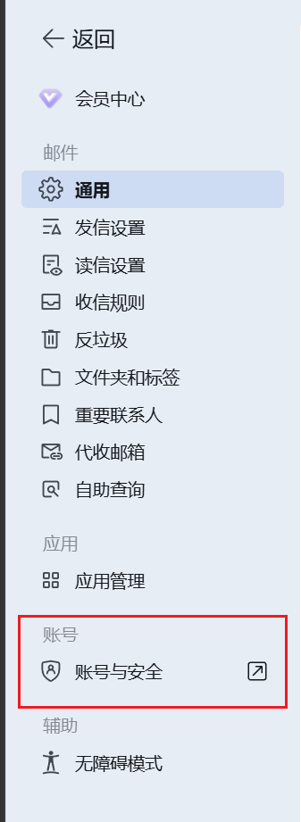
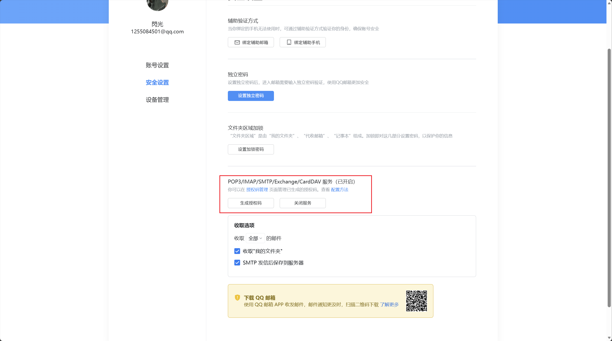
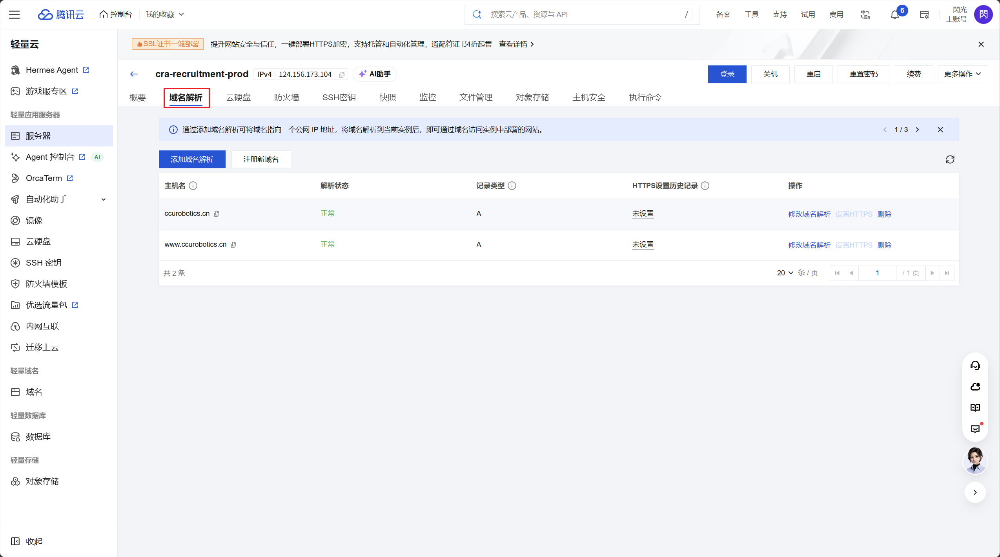

# RE：从零开始的协会招新平台搭建教程

##### 作者： XCrane（刘潇阳） 联系邮箱：1255084501@qq.com

本文为 CRA 招新平台的搭建教程。

2026 届招新平台配置环境：

- 域名：`ccurobotics.cn`

- 腾讯云轻量应用服务器，中国香港地域

- Ubuntu 24.04 LTS，2 核 CPU、4 GB 内存、70 GB SSD

- Node.js 24，Nginx，systemd，Let's Encrypt

- 一个 Fastify 进程同时提供官网、报名端、管理端和 API

- SQLite 数据库：`/var/lib/cra-recruitment/cra.db`

平台架构如下图：

```text
用户浏览器
    │  https://ccurobotics.cn
    ▼
腾讯云 DNS → 轻量应用服务器公网 IP
    │
    ├── 80：跳转到 HTTPS
    └── 443：Nginx 终止 TLS
                 │
                 ▼
           127.0.0.1:3000
                 │
          Node.js + Fastify
        ├── 官网与报名端
        ├── 管理端和 API
        └── SQLite 数据库
```

## 一、账号准备

（以腾讯云为例）

1. 打开[腾讯云官网](https://cloud.tencent.com/)

2. 注册并登录腾讯云账号。

<p align="center">
  
</p>

3. 通过右上角“ 头像”进入“账号中心”，并选择侧边栏“实名认证”后完成。
<p align="center">
  
</p>

- [腾讯云实名认证说明](https://cloud.tencent.com/document/product/242/39039)

## 二、域名准备

- [腾讯云域名注册](https://cloud.tencent.com/product/domain)

<p align="center">
  
</p>

1. 选择 .com/ .cn 域名。
2. 创建实名信息模板并等待审核通过（约1小时）。
3. 开启“禁止转移锁”和“禁止更新锁”。

- [快速注册域名及实名认证](https://cloud.tencent.com/document/product/242/39039)
- [信息模板管理](https://cloud.tencent.com/document/product/242/15435)

## 三、服务器准备

- [腾讯云服务器购买页](https://buy.cloud.tencent.com/lighthouse)

- [备案说明](https://cloud.tencent.com/document/api/243/19630)

**创建方式：**

> 基于操作系统镜像

**系统：**

> Ubuntu 24.04 LTS

**地域：**

> 中国香港 或 北京（**见下文**）

**套餐规格：**

> 至少 2 核 CPU 4 GB 内存

> 至少 40 GB 系统盘

> 至少 1TB/月 流量包

> 登录方式：SSH 密钥登录

> 服务器名称：cra-recruitment-prod

**域名解析会在后文指导配置，不必一键配置**

***SSH 密钥需严密保存 .pem 私钥文件***

***！！！勿泄露！！！***

<p align="center">
  
</p>

（上面广告里幻兽帕鲁挺好玩的）

---
### 关于国内（北京）服务器的相关说明

根据

- [腾讯云备案要求](https://cloud.tencent.com/document/product/243/19644)

- [腾讯云备案流程](https://cloud.tencent.com/document/product/243/39038)

- [个人备案内容要求](https://cloud.tencent.com/document/product/243/19644)

- [个人网站性质说明](https://cloud.tencent.com/document/product/243/19628)

明确规定，个人备案不能涉及企业、团体等内容。

因为域名所有者机器人协会通常不是独立法人，无法直接以“协会”作为单位备案主体，只能依托学校提供或确认：

- 学校作为备案主体

- 事业单位相关证件

- 法定代表人或网站负责人信息

- 网站负责人授权材料

- 同意此网站使用学校和协会名义

个人建议，依托学校协助之前需明确此网站的相关归属，避免“职权越界”、“外行指导内行”。或直接选用香港服务器。

## 四、防火墙配置

> 置顶说明：我不认为自己计网方面造诣多高，还望读者对此部分进一步增强修缮。

- [腾讯云轻量应用服务控制台](https://console.cloud.tencent.com/lighthouse/instance/index)

<p align="center">
  
</p>

| 应用类型 | 来源 | 协议 | 端口 | 策略 |
|---|---|---|---|---|
| HTTP | 全部 IPv4 | TCP | 80 | 允许 |
| HTTPS | 全部 IPv4 | TCP | 443 | 允许 |
| SSH | 公网 IP `/32`或全部IPv4 | TCP | 22 | 允许 |
| Ping | 全部 IPv4 | ICMP | ALL | 可选 |

仅作参考：

<p align="center">
  
</p>

公网 IP 查询命令 `Windows PowerShell`：

```powershell
$currentIPv4 = (Invoke-RestMethod "https://api.ipify.org").Trim()
$currentIPv4
```

## 五、保护 SSH 私钥

```powershell
$sourceKeyPath = "替换为下载目录\XXXX.pem"
$sshDirectory = "$env:USERPROFILE\.ssh"
$secureKeyPath = "$sshDirectory\XXXX.pem"

New-Item -ItemType Directory -Force -Path $sshDirectory
Copy-Item -LiteralPath $sourceKeyPath -Destination $secureKeyPath -Force

icacls $secureKeyPath /inheritance:r
icacls $secureKeyPath /grant:r "$($env:USERNAME):(R)"
icacls $secureKeyPath /remove "NT AUTHORITY\Authenticated Users"
icacls $secureKeyPath /remove "BUILTIN\Users"
icacls $secureKeyPath /remove "Everyone"
icacls $secureKeyPath
```

## 六、SSH 登录

> 建议读者掌握 SSH 登录，在机器人方面也经常需要使用。

检查端口：

```powershell
Test-NetConnection $serverIp -Port 22
```

（serverIp 指服务器 IP，请勿真打个 serverIp 进去）

（二次补充：服务器 IP 不是你的公网 IP）

出现 `TcpTestSucceeded : True` 后连接：

```powershell
ssh -i $secureKeyPath -l ubuntu $serverIp
```

核对 IP 后输入 `yes`。

若显示 `Identity file -l not accessible`，通常可能为 `$secureKeyPath` 未赋值或参数顺序错误。重新定义变量并使用上面的完整命令。

## 七、初始化 Ubuntu

服务器内执行：

```bash
sudo hostnamectl set-hostname cra-recruitment-prod
sudo timedatectl set-timezone Asia/Shanghai

sudo apt update
sudo apt full-upgrade -y
sudo apt install -y \
  ca-certificates \
  curl \
  git \
  nginx \
  openssl \
  rsync \
  certbot \
  python3-certbot-nginx \
  unattended-upgrades

sudo systemctl enable --now unattended-upgrades
```

若系统更新内核：

```bash
sudo reboot
```

等待一两分钟后重新连接服务器。

## 八、加固 SSH

Ubuntu 24.04 可能使用 `ssh.socket` 按需启动 SSH，`ssh.service` 显示 `inactive` 不一定是故障：

```bash
sudo systemctl is-active ssh.socket
sudo systemctl is-enabled ssh.socket
sudo systemctl status ssh.socket ssh.service --no-pager
sudo ss -lntp | grep ':22'
```

若 `sudo sshd -t` 报 `Missing privilege separation directory: /run/sshd`：

```bash
sudo install -d -o root -g root -m 0755 /run/sshd
sudo sshd -t
```

创建加固配置：

```bash
sudoedit /etc/ssh/sshd_config.d/99-cra-hardening.conf
```

内容：

```text
PermitRootLogin no
PasswordAuthentication no
KbdInteractiveAuthentication no
PubkeyAuthentication yes
AuthenticationMethods publickey
AllowUsers ubuntu
MaxAuthTries 3
```

检查并重新加载：

```bash
sudo sshd -t
sudo sshd -T | grep -E \
  'passwordauthentication|kbdinteractiveauthentication|permitrootlogin|pubkeyauthentication|authenticationmethods|allowusers|maxauthtries'
sudo systemctl restart ssh.socket
```

同时于第二个 PowerShell 窗口测试密钥登录。

## 九、安装 Node.js 24

项目要求 Node.js 24 或更高版本。

systemd 使用系统级 `/usr/bin/node` 和 `/usr/bin/npm`。

NodeSource 安装脚本：

```bash
curl -fsSL https://deb.nodesource.com/setup_24.x \
  -o /tmp/nodesource_setup.sh
less /tmp/nodesource_setup.sh
sudo -E bash /tmp/nodesource_setup.sh
sudo apt install -y nodejs
```

验证：

```bash
node --version
npm --version
command -v node
command -v npm
```

> npm 当前能用的情况下，请勿随意升级，能跑就别动。

## 十、创建低权限运行账户

服务器内执行：

```bash
sudo adduser --system \
  --group \
  --home /var/lib/cra-recruitment \
  --shell /usr/sbin/nologin \
  cra-recruitment

sudo install -d \
  -o cra-recruitment \
  -g cra-recruitment \
  -m 0700 \
  /var/lib/cra-recruitment

sudo install -d \
  -o root \
  -g cra-recruitment \
  -m 0750 \
  /opt/cra-recruitment
```

检查：

```bash
id cra-recruitment
ls -ld /var/lib/cra-recruitment /opt/cra-recruitment
```

> `ubuntu` 不能直接进入 `/opt/cra-recruitment` 很正常的，请勿用 `chmod 777` 解决。

## 十一、GitHub 获取并验证项目

**临时目录**构建：

```bash
release_dir="$(mktemp -d /tmp/cra-release.XXXXXX)"
git clone "替换为 GitHub 仓库地址" "$release_dir"
cd "$release_dir"
npm ci
npm run check:release
```

`check:release` 进行用户端和管理端构建、类型检查、16 项后端测试，以及 100 人并发报名基线。

> （以后你们做大了，可以把 100 人改一下）

执行依赖审计：

```bash
npm audit --omit=dev
npm --prefix server audit --omit=dev
npm --prefix server/admin-web audit --omit=dev
```

> 若 `npm ci` 报 `package.json` 和锁文件不同步，请勿用 `npm install` 糊弄过去。

解决方案：

```powershell
cd 盘:\CRA_Interview_Platform
npm install --package-lock-only
npm ci
npm run check:release
git add package-lock.json server/package-lock.json server/admin-web/package-lock.json
git commit -m "fix: synchronize npm lockfiles"
git push
```

重新获取已经修复的提交。

## 十二、安装发布文件

服务器的临时发布目录执行：

```bash
sudo rsync -a \
  --delete \
  --exclude='.git/' \
  --exclude='server/.env.production' \
  ./ /opt/cra-recruitment/

sudo chown -R root:cra-recruitment /opt/cra-recruitment
sudo chmod -R o-rwx /opt/cra-recruitment
sudo chmod -R g+rX /opt/cra-recruitment
```

检查构建产物：

```bash
sudo -u cra-recruitment test \
  -f /opt/cra-recruitment/dist/web/index.html
sudo -u cra-recruitment test \
  -f /opt/cra-recruitment/dist/admin/index.html
```

## 十三、注册 SMTP 服务

以[QQ邮箱](https://mail.qq.com)为例。

进入右上角“设置”。

<p align="center">
  
</p>

在侧边栏选择“账号与安全”。

<p align="center">
  
</p>

此处生成授权码。

<p align="center">
  
</p>

## 十四、配置生产环境变量

生成 JWT 密钥：

```bash
openssl rand -base64 48
```

将输出安全保存，仅此一次。创建生产配置：

```bash
sudo install \
  -o root \
  -g cra-recruitment \
  -m 0640 \
  /dev/null \
  /opt/cra-recruitment/server/.env.production

sudoedit /opt/cra-recruitment/server/.env.production
```

填写：

```dotenv
NODE_ENV=production
CRA_ENV=production

CRA_HOST=127.0.0.1
CRA_PORT=3000
CRA_PUBLIC_ORIGIN=https://ccurobotics.cn
CRA_TRUST_PROXY=127.0.0.1
CRA_COOKIE_SECURE=1

CRA_DATA_DIR=/var/lib/cra-recruitment
CRA_DB_FILE=cra.db

CRA_JWT_SECRET=替换为刚生成的随机密钥
CRA_ADMIN_USERNAME=admin
CRA_ADMIN_PASSWORD=替换为唯一的管理员强密码
CRA_ADMIN_DISPLAY_NAME=系统管理员

CRA_SMTP_HOST=替换为邮箱服务商的SMTP地址
CRA_SMTP_PORT=465
CRA_SMTP_SECURE=1
CRA_SMTP_USER=替换为发信邮箱
CRA_SMTP_PASS=替换为SMTP授权码
CRA_SMTP_FROM="长春大学机器人协会招新 <替换为发信邮箱>"

CRA_JWT_EXPIRES_IN=43200
CRA_SEED_DEMO_DATA=0
CRA_LOG_LEVEL=info
CRA_BACKUP_RETENTION_DAYS=30
CRA_HEALTHCHECK_URL=https://ccurobotics.cn

CRA_BODY_LIMIT_BYTES=131072
CRA_CONNECTION_TIMEOUT_MS=10000
CRA_REQUEST_TIMEOUT_MS=15000
CRA_HANDLER_TIMEOUT_MS=60000
CRA_PASSWORD_CONCURRENCY=4
CRA_PASSWORD_QUEUE_LIMIT=256
```

验证所有者和权限：

```bash
sudo stat -c '%U %G %a %n' \
  /opt/cra-recruitment/server/.env.production
```

预期：

```text
root cra-recruitment 640 /opt/cra-recruitment/server/.env.production
```

## 十五、运行生产预检

预检会检查生产模式、静态构建、SMTP 连接、数据目录可写、数据库迁移和管理员账号：

```bash
sudo -u cra-recruitment -H /bin/bash -c \
  'cd /opt/cra-recruitment/server && /usr/bin/npm run preflight:production'
```

输出：

```json
{
  "status": "ready-for-production-start",
  "publicOrigin": "https://ccurobotics.cn",
  "dataDir": "/var/lib/cra-recruitment",
  "database": "/var/lib/cra-recruitment/cra.db",
  "activeAdmins": 1
}
```

## 十六、安装 systemd 服务

仓库已提供经过安全收紧的单位文件：

```bash
sudo install -o root -g root -m 0644 \
  /opt/cra-recruitment/deploy/systemd/cra-recruitment.service.example \
  /etc/systemd/system/cra-recruitment.service

sudo install -o root -g root -m 0644 \
  /opt/cra-recruitment/deploy/systemd/cra-backup.service.example \
  /etc/systemd/system/cra-backup.service

sudo install -o root -g root -m 0644 \
  /opt/cra-recruitment/deploy/systemd/cra-backup.timer.example \
  /etc/systemd/system/cra-backup.timer

sudo install -o root -g root -m 0644 \
  /opt/cra-recruitment/deploy/systemd/cra-healthcheck.service.example \
  /etc/systemd/system/cra-healthcheck.service

sudo install -o root -g root -m 0644 \
  /opt/cra-recruitment/deploy/systemd/cra-healthcheck.timer.example \
  /etc/systemd/system/cra-healthcheck.timer

sudo systemctl daemon-reload
sudo systemctl enable --now cra-recruitment
```

检查应用：

```bash
sudo systemctl is-active cra-recruitment
sudo systemctl status cra-recruitment --no-pager
sudo journalctl -u cra-recruitment -n 100 --no-pager
curl -fsS http://127.0.0.1:3000/api/health/ready
```

## 十七、配置域名解析

<p align="center">
  
</p>

在腾讯云轻量应用服务器实例中打开“域名解析”，为 `ccurobotics.cn` 添加：

| 主机记录 | 类型 | 记录值 |
|---|---|---|
| `@` | A | 服务器公网 IPv4 |
| `www` | A | 服务器公网 IPv4 |

`@` 表示根域名，`www` 表示 `www.ccurobotics.cn`。请勿使用 URL 隐性转发代替 A 记录。

- [主机记录说明](https://cloud.tencent.com/document/product/302/105285)。

Windows Powershell 验证：

```powershell
Resolve-DnsName ccurobotics.cn
Resolve-DnsName www.ccurobotics.cn
```

两者都应返回服务器公网 IP。DNS 传播可能需要等待，未生效前请勿申请证书。

## 十八、配置 HTTP Nginx

创建站点：

```bash
sudoedit /etc/nginx/sites-available/cra-recruitment
```

申请证书前先填写仅 HTTP 的配置：

```nginx
limit_req_zone $binary_remote_addr zone=cra_public:10m rate=20r/s;

server {
    listen 80;
    listen [::]:80;
    server_name ccurobotics.cn www.ccurobotics.cn;

    client_max_body_size 128k;

    location / {
        limit_req zone=cra_public burst=60 nodelay;
        proxy_pass http://127.0.0.1:3000;
        proxy_http_version 1.1;
        proxy_set_header Host $host;
        proxy_set_header X-Real-IP $remote_addr;
        proxy_set_header X-Forwarded-For $proxy_add_x_forwarded_for;
        proxy_set_header X-Forwarded-Proto $scheme;
        proxy_connect_timeout 10s;
        proxy_send_timeout 65s;
        proxy_read_timeout 65s;
    }
}
```

启用站点：

```bash
sudo ln -s \
  /etc/nginx/sites-available/cra-recruitment \
  /etc/nginx/sites-enabled/cra-recruitment

if [ -L /etc/nginx/sites-enabled/default ]; then
  sudo unlink /etc/nginx/sites-enabled/default
fi

sudo nginx -t
sudo systemctl reload nginx
curl -I http://ccurobotics.cn
curl -fsS http://ccurobotics.cn/api/health/ready
```

直到显示 HTTP 正常，才能继续申请 HTTPS。

## 十九、申请 HTTPS 证书

```bash
sudo certbot --nginx \
  -d ccurobotics.cn \
  -d www.ccurobotics.cn
```

按提示填写续期通知邮箱、同意协议，并选择 HTTP 跳转 HTTPS。

证书成功后，将 Nginx 配置整理为当前线上实际使用的版本：

```nginx
limit_req_zone $binary_remote_addr zone=cra_public:10m rate=20r/s;

server {
    listen 80;
    listen [::]:80;
    server_name ccurobotics.cn www.ccurobotics.cn;
    return 301 https://ccurobotics.cn$request_uri;
}

server {
    listen 443 ssl http2;
    listen [::]:443 ssl http2;
    server_name www.ccurobotics.cn;

    ssl_certificate /etc/letsencrypt/live/ccurobotics.cn/fullchain.pem;
    ssl_certificate_key /etc/letsencrypt/live/ccurobotics.cn/privkey.pem;
    include /etc/letsencrypt/options-ssl-nginx.conf;
    ssl_dhparam /etc/letsencrypt/ssl-dhparams.pem;

    return 301 https://ccurobotics.cn$request_uri;
}

server {
    listen 443 ssl http2;
    listen [::]:443 ssl http2;
    server_name ccurobotics.cn;

    ssl_certificate /etc/letsencrypt/live/ccurobotics.cn/fullchain.pem;
    ssl_certificate_key /etc/letsencrypt/live/ccurobotics.cn/privkey.pem;
    include /etc/letsencrypt/options-ssl-nginx.conf;
    ssl_dhparam /etc/letsencrypt/ssl-dhparams.pem;

    client_max_body_size 128k;

    location / {
        limit_req zone=cra_public burst=60 nodelay;
        proxy_pass http://127.0.0.1:3000;
        proxy_http_version 1.1;
        proxy_set_header Host $host;
        proxy_set_header X-Real-IP $remote_addr;
        proxy_set_header X-Forwarded-For $proxy_add_x_forwarded_for;
        proxy_set_header X-Forwarded-Proto $scheme;
        proxy_connect_timeout 10s;
        proxy_send_timeout 65s;
        proxy_read_timeout 65s;
    }
}
```

检查并重载：

```bash
sudo nginx -t
sudo systemctl reload nginx

curl -I http://ccurobotics.cn
curl -I https://ccurobotics.cn
curl -I https://www.ccurobotics.cn
curl -fsS https://ccurobotics.cn/api/health/ready
```

输出：

- `http://ccurobotics.cn` 返回 301 到 HTTPS。

- `https://www.ccurobotics.cn` 返回 301 到无 `www` 域名。

- `https://ccurobotics.cn` 返回 200。

- 就绪接口返回 `"status":"ready"` 和 `"database":"ok"`。

## 二十、启用备份和健康检查

启用定时器：

```bash
sudo systemctl enable --now cra-backup.timer
sudo systemctl enable --now cra-healthcheck.timer
sudo systemctl enable --now certbot.timer

sudo systemctl list-timers \
  cra-backup.timer \
  cra-healthcheck.timer \
  certbot.timer
```

立即手动执行一次：

```bash
sudo systemctl start cra-backup.service
sudo systemctl start cra-healthcheck.service

sudo systemctl status cra-backup.service --no-pager
sudo systemctl status cra-healthcheck.service --no-pager
sudo journalctl -u cra-backup.service -n 50 --no-pager
sudo journalctl -u cra-healthcheck.service -n 50 --no-pager
```

备份默认写入：

```text
/var/lib/cra-recruitment/backups/
```

> 文件权限为 0600，保留天数由 `CRA_BACKUP_RETENTION_DAYS` 控制。

## 二十一、执行隔离恢复验证

恢复验证只复制最新备份到临时目录检查，不会覆盖正式数据库，也不需要停止服务：

```bash
sudo -u cra-recruitment -H /bin/bash -c \
  'cd /opt/cra-recruitment/server && /usr/bin/npm run restore:verify'
```

输出：

```json
{
  "status": "restore-verified",
  "source": "/var/lib/cra-recruitment/backups/cra-时间戳.db",
  "summary": {
    "users": 1,
    "rounds": 0,
    "slots": 0,
    "applications": 0
  }
}
```

请勿用 `ubuntu` 直接 `cd /opt/cra-recruitment/server`；出现 `Permission denied` 是目录权限在正常保护应用。应使用 `sudo -u cra-recruitment` 。

## 二十二、验收

基础状态：

```bash
sudo systemctl is-active cra-recruitment nginx
sudo systemctl is-active \
  cra-backup.timer \
  cra-healthcheck.timer \
  certbot.timer

sudo nginx -t
curl -fsS http://127.0.0.1:3000/api/health/ready
curl -fsS https://ccurobotics.cn/api/health/ready
```

流程：

1. 打开主页面。

2. 进入报名入口。

3. 获取真实邮箱验证码。

4. 填写资料、设置密码、选择有效时段并提交。

5. 使用学号和密码登录“我的报名”。

6. 查看并修改报名资料和时段。

7. 登录 `/admin/`。

8. 查看报名、导出 CSV、调整轮次和时段。

9. 确认报名截止后候选人不能再修改。

10. 验证退出登录后旧会话失效。

需**两人**“***交叉确认***”轮次**起止日期**、**所有面试日期**、**时段容量**、**SMTP 收件效果**和**隐私告知**。

## 二十三、查询命令

```bash
# 服务状态
sudo systemctl status cra-recruitment --no-pager

# 最近日志
sudo journalctl -u cra-recruitment -n 100 --no-pager

# 持续查看日志
sudo journalctl -u cra-recruitment -f

# Nginx 状态和语法
sudo systemctl status nginx --no-pager
sudo nginx -t

# 端口监听
sudo ss -lntp

# CPU、内存、磁盘
uptime
free -h
df -h

# 定时器
sudo systemctl list-timers \
  cra-backup.timer \
  cra-healthcheck.timer \
  certbot.timer

# 健康检查
curl -fsS http://127.0.0.1:3000/api/health/ready
curl -fsS https://ccurobotics.cn/api/health/ready
```

## 二十四、故障集齐任

### SSH 端口超时

Windows：

```powershell
Test-NetConnection $serverIp -Port 22
```

若 `Ping` 成功但 22 失败，可能腾讯云防火墙的 SSH 来源仍是旧公网 IP。重新查询当前公网 IP，并更新为 `/32`就 ok。

### SSH 私钥权限过宽

重新执行第 7 节的 `icacls` 命令。

### `ssh.service inactive`

检查：

```bash
sudo systemctl is-active ssh.socket
sudo ss -lntp | grep ':22'
```

若 `ssh.socket` 为 `active` 且 22 正在监听，按需启动模式正常。

### `Missing privilege separation directory: /run/sshd`

```bash
sudo install -d -o root -g root -m 0755 /run/sshd
sudo sshd -t
```

### `npm ci` 锁文件不同步

运行 `npm install --package-lock-only`，重新执行 `npm ci` 和 `npm run check:release`，提交锁文件后再部署。

### 无法进入 `/opt/cra-recruitment`

0750 权限的预期行为。请勿改成 777。使用明确的 `sudo` 或以 `cra-recruitment` 账户运行只读/运维命令。

### Nginx 返回 502

先检查后端：

```bash
sudo systemctl is-active cra-recruitment
curl -v http://127.0.0.1:3000/api/health/ready
sudo journalctl -u cra-recruitment -n 200 --no-pager
```

应用刚启动时，预检和迁移需要短暂时间；如果几秒后本机接口恢复，公网 502 也会随之恢复。

### 域名打不开或证书申请失败

依次检查：

```powershell
Resolve-DnsName ccurobotics.cn
Test-NetConnection $serverIp -Port 80
Test-NetConnection $serverIp -Port 443
```

```bash
sudo nginx -t
curl -I http://ccurobotics.cn
sudo journalctl -u nginx -n 100 --no-pager
```

DNS 必须先指向服务器，80/443 必须开放，Nginx 配置必须通过，Certbot 才能成功。

### 邮箱验证码发送失败

```bash
sudo -u cra-recruitment -H /bin/bash -c \
  'cd /opt/cra-recruitment/server && /usr/bin/npm run preflight:production'
sudo journalctl -u cra-recruitment -n 200 --no-pager
```

检查 SMTP 地址、端口、TLS 选项、账号、授权码和发件人是否一致。

补充：得有面试报名活动才能发验证码。

### 浏览器样式错误

先按 `Ctrl + F5` 强制刷新。静态文件修改后应更新 HTML 中相应资源的 `?v=` 缓存版本，并重新执行构建和部署。

## 二十五、安全

- 服务器只对公网开放 80、443 这两个端口。

- SSH 22 只允许一个当前 IP。

- Node.js 只监听 `127.0.0.1:3000`。

- 以 `cra-recruitment` 低权限账户运行。

- `.env.production` 为 `root:cra-recruitment`、0640。

- 数据目录为 `cra-recruitment:cra-recruitment`、0700。

- 报名数据、备份和导出 CSV 限制访问和保留时间。

- 异机加密存储。

## 二十六、End

最后，说一些话。

首先，我希望读者不是作为一个被需要的工具来阅读这篇文档。

我希望你们有所成长，有所获得。

其次，我希望你们能够严肃地对待协会的招新平台，切勿做个草台班子。

我希望协会的招新平台能够延续。

我希望协会的招新平台足够公平正义。

以上。

如果存疑或是其他想说的，联系邮箱在标题下方。